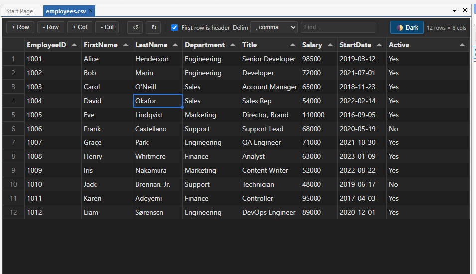

# Clarion CSV Editor

A CSV / TSV viewer and editor addin for the Clarion IDE. Opens `.csv` and `.tsv`
files in an editable grid rendered with [Tabulator](https://tabulator.info/)
inside a WebView2 control, instead of the default plain-text editor.



> Status: **v0.2.0** — full open → edit → save loop with a spreadsheet-style grid
> (Tier 1 feature set). See [Roadmap](#roadmap) for what's next.

## Features

- Registers as the handler for `.csv` and `.tsv` files; each file opens in its
  own editor document tab (titled with the file name).
- **Integrates with the IDE's native File menu** — **File → Open** routes here,
  and **File → Save** / **Save As** (and `Ctrl+S`) save the grid. The unsaved `*`
  marker and the close-without-saving prompt work like any other editor, and the
  `*` clears when you undo back to the saved state.
- **Editing**: editable cells; add / delete rows; add / delete columns; rename a
  column by double-clicking its header.
- **Spreadsheet-style selection & clipboard**: cell-range selection (drag,
  Shift-click), whole-row (row-number gutter) and whole-column (header) selection,
  and copy / paste as TSV that round-trips with Excel.
- **Undo / redo** (`Ctrl+Z` / `Ctrl+Y`) for edits and row add/delete.
- **Sorting** by a column's sort arrow — view-only, so a save preserves the
  file's original row order.
- **Find** box that filters rows by any cell; hidden rows are still saved.
- **Delimiter** auto-detection (comma / semicolon / tab / pipe) with a manual
  picker, plus header-row auto-detection with a toolbar toggle.
- Faithful round-trip: original line endings, trailing newline, and necessary
  quoting are preserved.
- In-editor dark mode toggle, persisted across sessions.
- Fully offline — Tabulator and Papa Parse are bundled locally; no CDN.

## How it works

This follows the same architecture as the
[Clarion Markdown Editor](../clarion-markdown-editor):

| Layer | File |
| --- | --- |
| File-type handler | `CsvDisplayBinding.cs` (`IDisplayBinding`) |
| Document tab | `CsvEditorViewContent.cs` (`AbstractViewContent`) |
| Dockable pad | `CsvEditorPad.cs` (`AbstractPadContent`) |
| WebView2 host | `CsvEditorControl.cs` |
| Grid front-end | `Resources/csv-editor.{html,css,js}` |

The C# host owns the file on disk; the JavaScript grid owns the editing UI. They
communicate over WebView2 web messages:

- **C# → JS**: `ExecuteScriptAsync("loadCsv(text, name, delimiter)")`,
  `setDarkMode(...)`, `onFileSaved(...)`
- **JS → C# (object)**: `postMessage({ type: "ready" | "dirtyChanged" | "saveRequested" | "darkModeChanged", ... })`
- **JS → C# (string)**: `postMessage("CSV:" + getCsv())` — the current grid
  serialised back to CSV (via Papa Parse `unparse`).

### Saving

The IDE's `File > Save` calls `ViewContent.Save(string)` **synchronously**, while
WebView2's `ExecuteScriptAsync` is asynchronous — blocking on it from the UI thread
would deadlock. So the host pulls the grid as CSV at save time via
`commitAndGetCsv()` (which first commits any in-progress cell edit); the synchronous
menu Save pumps the message loop until the result arrives, while the in-page
`Ctrl+S` path saves asynchronously. The page also pushes a `"CSV:"` snapshot after
every change as a fallback (a raw string, not JSON, to avoid escaping a large
payload). Dirty state is a comparison against the content as last loaded/saved, so
undoing every change clears the `*`.

## Building

Requires the .NET Framework 4.8 developer pack and a Clarion install.

```pwsh
dotnet build ClarionCsvEditor.slnx -c Release
```

The build references `ICSharpCode.Core.dll` and `ICSharpCode.SharpDevelop.dll`
from the Clarion `bin` directory. Point it at your install via one of:

1. `CLARION_BIN` environment variable
2. a gitignored `ClarionCsvEditor/Directory.Build.props.user` (see the sample committed alongside)
3. `dotnet build /p:ClarionBin=C:\Clarion\Clarion11.1\bin`

`WebView2Loader.dll` is auto-copied to the output root after build.

## Deploying

Copy the build output to `<Clarion>\accessory\addins\ClarionCsvEditor\` (the
`deploymentPath` in `addin-config.json`), including the `Resources/` folder. This
is the same folder the addin-finder installs into, so a dev deploy overwrites the
released install.

## Roadmap

Tier 1 (above) is done. Next up:

- Encoding awareness (UTF-8 BOM / others) and reload-on-external-change.
- Right-click context menu, find & replace, per-column filters.
- Numeric/date-aware display, frozen columns, column statistics.
- Large-file streaming for multi-hundred-MB files.

## Testing

Three layers run without the IDE (see `tests/`):

- **JS unit** — `node --test tests/grid.test.js`: parse/serialise, delimiter and
  header detection, and dirty-state logic, exercised against the real page script.
- **C# helpers** — `dotnet run --project tests/JsonInterop.Tests`: the JSON
  decode/extract helpers (links the real source, no NuGet).
- **End-to-end** — `npx playwright test`: drives the real grid in headless
  Chromium — sort, search, undo/redo, range selection, copy/paste, add/delete row
  & column, header rename, delimiter picker.

## Third-party

Bundled under `Resources/`, both MIT:

- [Tabulator](https://github.com/olifolkerd/tabulator) v6.3.1
- [Papa Parse](https://github.com/mholt/PapaParse) v5.4.1

See [THIRD_PARTY_LICENSES.md](THIRD_PARTY_LICENSES.md).

## License

MIT © 2026 Mark Sarson. See [LICENSE](LICENSE).
